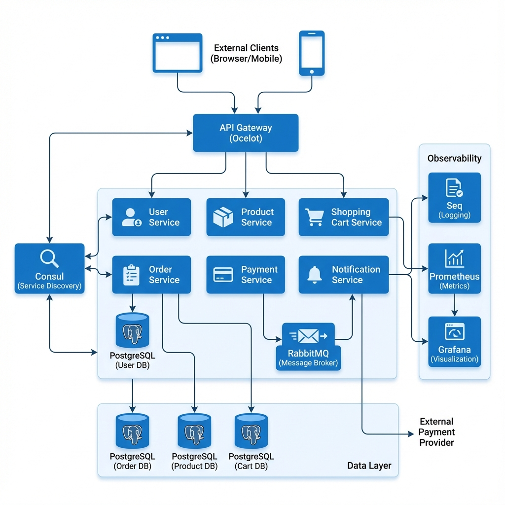

Follow up: https://roadmap.sh/projects/scalable-ecommerce-platform

# 🚀 E-commerce Microservices Platform

This repository contains a full-stack, distributed e-commerce platform built using **.NET 10 Microservices** orchestrated via **Docker Compose**. The architecture is designed for scalability, using Service Discovery (Consul) and Asynchronous Communication (RabbitMQ).

---

## 1. 🏗️ Architecture Overview

The system is composed of **7 Core Microservices** and **5 Infrastructure Services**, unified by an API Gateway.

### Key Components

| Component                 | Responsibility                               | Technology                                | Port   |
| :------------------------ | :------------------------------------------- | :---------------------------------------- | :----- |
| **API Gateway**           | External Entry Point, Routing, Auth          | Ocelot (**.NET 10**)                      | `80`   |
| **User Service**          | User Identity, Authentication (JWT)          | **.NET 10**, PostgreSQL, ASP.NET Identity | `5001` |
| **Product Service**       | Product Catalog, Inventory                   | **.NET 10**, PostgreSQL                   | `5002` |
| **Shopping Cart Service** | Cart State Management                        | **.NET 10**, PostgreSQL                   | `5003` |
| **Order Service**         | Transaction Orchestration, Order Record      | **.NET 10**, PostgreSQL                   | `5004` |
| **Payment Service**       | Mock External Payment Processor              | **.NET 10**                               | `5005` |
| **Notification Service**  | Asynchronous Event Consumer (Email/SMS Mock) | **.NET 10**, MassTransit                  | `5006` |

### Infrastructure

| Service        | Purpose              | Access                                 |
| :------------- | :------------------- | :------------------------------------- |
| **Consul**     | Service Discovery    | `http://localhost:8500`                |
| **RabbitMQ**   | Message Broker       | `http://localhost:15672` (guest/guest) |
| **Seq**        | Centralized Logging  | `http://localhost:5341`                |
| **Prometheus** | Metrics Collection   | `http://localhost:9090`                |
| **Grafana**    | Monitoring Dashboard | `http://localhost:3000` (admin/admin)  |

### Communication Flow (The Core Transaction)

The system uses a mix of synchronous HTTP calls (via **Consul** lookup) and asynchronous event messaging (via **RabbitMQ**).

1.  **Synchronous (HTTP):** External Client $\rightarrow$ **API Gateway** $\rightarrow$ **Consul** $\rightarrow$ **Order Service** $\rightarrow$ **Cart, Product, Payment** Services.
2.  **Asynchronous (Event-Driven):** **Order Service** (Publishes `OrderPlacedEvent`) $\rightarrow$ **RabbitMQ** $\rightarrow$ **Notification Service** (Consumes event).



---

## 2. ⚙️ Getting Started (Local Setup)

### Prerequisites

- Docker Desktop (with Compose V2)
- **.NET 10 SDK**
- A REST client (e.g., Postman, cURL)

### Installation

1.  **Clone the repository:**

    ```bash
    git clone [your-repo-link]
    cd [repo-name]
    ```

2.  **Build and Run All Services:**
    The single `docker compose` command builds the 7 microservices, initializes the 4 PostgreSQL databases, and launches all 5 infrastructure components.

    ```bash
    docker compose up --build -d
    ```

    _(This may take a few minutes on the first run as images are built and databases are initialized.)_

3.  **Verify Startup:**
    Check that all 12 containers are running (`Up` status):
    ```bash
    docker ps
    ```

---

## 3. 🧪 Testing and Verification

### Quick Health Check

Verify the API Gateway, Consul, and Seq are accessible:

- **API Gateway:** `http://localhost/` (Should return 404/Not Found, but accessible)
- **Consul UI:** `http://localhost:8500`
- **Seq UI:** `http://localhost:5341`

### End-to-End Functional Test

This sequence verifies the entire platform, including database persistence, inventory reduction, payment processing, and asynchronous notification.

| Step                | Method | URL                                       | Body / Notes                                                                                       |
| :------------------ | :----- | :---------------------------------------- | :------------------------------------------------------------------------------------------------- |
| **1. Register**     | `POST` | `http://localhost/api/user/auth/register` | JSON: `{"email": "user@test.com", "password": "Password123!", "fullName": "Test User"}`            |
| **2. Login**        | `POST` | `http://localhost/api/user/auth/login`    | JSON: `{"email": "user@test.com", "password": "Password123!"}`. **Copy the JWT Token**.            |
| **3. Load Cart**    | `POST` | `http://localhost/api/cart/add`           | Header `Authorization: Bearer <TOKEN>`<br>JSON: `{"productId": 1, "quantity": 1}`                  |
| **4. Place Order**  | `POST` | `http://localhost/api/orders/checkout`    | Header `Authorization: Bearer <TOKEN>`<br>JSON: `{"paymentInfo": "CreditCard"}`. Returns Order ID. |
| **5. Verify Order** | `GET`  | `http://localhost/api/orders/{id}`        | Header `Authorization: Bearer <TOKEN>`<br>Check status is `Placed`.                                |

---

## 4. 📊 Performance & Load Testing

This project includes a **k6** load testing script to verify the system's performance under load.

### Running the Load Test

1. Ensure all services are running (`docker compose up -d`).
2. Run the load test using Docker:

```bash
docker run --rm -i \
  --add-host=host.docker.internal:host-gateway \
  -v $(pwd)/tests/k6:/scripts \
  grafana/k6 run /scripts/load_test.js
```

### Test Scenario

- **Ramp-up:** 20 users over 30s
- **Steady State:** 20 users for 1m
- **Target:** API Gateway Product Endpoint (`/api/products`)

---

## 5. 🚀 Deployment

For detailed deployment instructions, including how to push images to Docker Hub and deploy to cloud providers (Azure, AWS, Kubernetes), please refer to the [Deployment Guide](DEPLOYMENT.md).

---

## 6. 🔧 Troubleshooting

- **Service Connectivity Issues:** Check `Consul` (http://localhost:8500) to ensure all services are registered and passing health checks.
- **Database Errors:** Ensure the PostgreSQL containers are healthy. The logs in `Seq` (http://localhost:5341) will provide detailed error traces.
- **"Username and password required" in CI/CD:** You need to set `DOCKER_USERNAME` and `DOCKER_PASSWORD` in your GitHub Repository Secrets.
